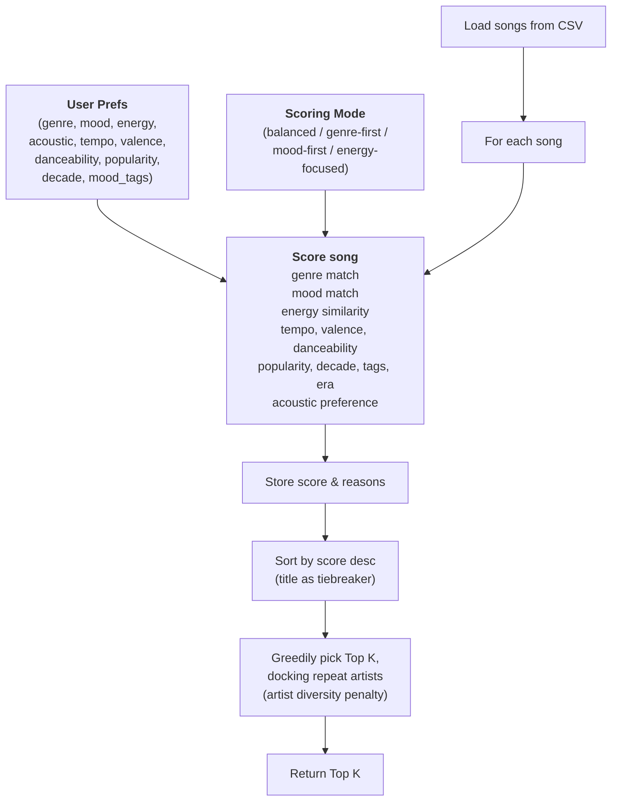

# 🎵 Music Recommender Simulation

## Project Summary

In this project you will build and explain a small music recommender system.

Your goal is to:

- Represent songs and a user "taste profile" as data
- Design a scoring rule that turns that data into recommendations
- Evaluate what your system gets right and wrong
- Reflect on how this mirrors real world AI recommenders

This version scores each song across 11 weighted features — genre, mood, energy, tempo, valence, danceability, popularity, release decade, mood tags, era descriptor, and acoustic preference — and returns the top K matches. Four scoring modes (balanced, genre-first, mood-first, energy-focused) let the caller shift emphasis depending on what matters most for a given user profile.

---

## How Real-World Music Recommenders Work

Services like Spotify and YouTube turn three separate kinds of information into a ranked list:

- **Input data** — facts about the content itself, independent of any listener: a track's genre, tempo, key, acoustic features, release date, and (for YouTube) watch-time and click-through statistics aggregated across all users.
- **User preferences** — signals tied to one listener: their play history, skips, likes, saved playlists, follows, and any explicit settings ("I like jazz"). This is the part that personalizes the system; input data alone would recommend the same thing to everyone.
- **Ranking/selection** — the step where a model scores every candidate track against a user's preference signals and returns the top-N, often blending in business goals like promoting new releases or maximizing session length.

The key distinction: input data describes the *catalog*, user preferences describe the *listener*, and ranking is the *function that combines the two into an ordered list*. Real systems typically use collaborative filtering (learning from what similar users liked) and content-based filtering (matching a track's own features to a user's stated or inferred taste) together, then re-rank for business or diversity goals. This project is a simplified, fully content-based version of that last idea: it has no collaborative signal (no other users, no play history) — it only compares each song's own features (genre, mood, energy, tempo, etc.) against one user's stated `UserProfile`, then sorts by the resulting score.

---

## How The System Works

Real recommendation systems combine many signals to predict what feels like a good next option. In this project, each `Song` carries genre, mood, energy, tempo, valence, danceability, acousticness, popularity, release decade, mood tags, and an era descriptor. The `UserProfile` stores a favorite genre, favorite mood, target energy level, acoustic preference, and optional numeric targets for tempo, valence, danceability, popularity, preferred decade, and mood tags.

The `Recommender` scores each song across all 11 features using a weighted formula. Categorical matches (genre, mood) add a flat bonus scaled by the active mode’s weight. Numeric features (energy, tempo, valence, danceability, popularity) add proximity points that decrease as the gap grows. Decade, mood tags, era descriptor, and acoustic preference add further bonuses when the song fits the listener’s era and vibe. A scoring mode — `balanced`, `genre-first`, `mood-first`, or `energy-focused` — multiplies each feature’s contribution so the caller can shift emphasis. Songs are then sorted by total score, with title as a tiebreaker, and the top K are returned.

### Algorithm Recipe

1. Load the songs from `data/songs.csv`.
2. Select a scoring mode (`balanced`, `genre-first`, `mood-first`, or `energy-focused`) which sets a weight multiplier for each feature.
3. Compare each song to the user's preferences one song at a time:
   - Add `1.0 × genre_weight` when the song's genre matches the user's favorite genre.
   - Add `1.0 × mood_weight` when the song's mood matches the user's favorite mood.
   - Add up to `6.0 × energy_weight` proximity points based on how close the song's energy is to the user's target.
   - Add up to `1.5 × tempo_weight` proximity points based on tempo closeness.
   - Add up to `1.25 × valence_weight` proximity points based on valence closeness.
   - Add up to `1.0 × danceability_weight` proximity points based on danceability closeness.
   - Add up to `1.3 × popularity_weight` proximity points based on popularity closeness.
   - Add up to `1.4 × decade_weight` bonus points when the song's release era matches the user's preferred decade.
   - Add up to `1.8 × tags_weight` bonus points for shared mood tags.
   - Add `0.9 × era_weight` when the song's era descriptor matches the inferred target era.
   - Add up to `2.0 × acoustic_weight` bonus based on whether the song's acousticness matches the user's acoustic preference.
4. Store each song's total score and the list of reasons that contributed to it.
5. Sort all songs by total score from highest to lowest, using title alphabetically as a tiebreaker.
6. Greedily fill the top K slots one at a time: for each remaining slot, pick the highest-scoring unpicked song, but subtract an `ARTIST_REPEAT_PENALTY` of `1.5` points from any song whose artist already has a pick in the results so far. This keeps a single artist from crowding out the whole list when their songs happen to score similarly.
7. Return the top K songs as the final, diversified recommendations.

### Potential Biases

This system might over-prioritize genre and energy, causing it to miss great songs that match the user's mood or overall vibe in a less direct way. Because the dataset is small and fixed, it can also reflect the limits of the catalog instead of the full range of real musical taste. The artist-repeat penalty (step 6) reduces one specific fairness risk — an artist dominating every slot — but it is a fixed-size handicap, not a true fairness guarantee: a strong enough score gap still lets the same artist sweep the list.

### Data Flow



---

## Getting Started

### Setup

1. Create a virtual environment (optional but recommended):

   ```bash
   python -m venv .venv
   source .venv/bin/activate      # Mac or Linux
   .venv\Scripts\activate         # Windows

2. Install dependencies

```bash
pip install -r requirements.txt
```

3. Run the app:

```bash
python -m src.main
```

### Terminal Output Screenshots

The screenshots below show top-5 terminal recommendations for adversarial and edge-case profiles used to stress-test the scoring logic.

1. Conflicting mood vs energy


2. String-bool trap for acoustic preference


3. Out-of-range high energy


4. Out-of-range negative energy


5. Unknown genre and unknown mood


6. Empty categorical fields with numeric targeting


7. Impossible preference bundle


### Sample Recommendation Output

`python -m src.main` prints a `tabulate` grid table per scoring mode, with per-song reasons and their point contributions. Table for the default `pop` / `happy` profile (`energy=0.85`, `likes_acoustic=False`) using the `balanced` scoring mode, `k=5`:

```
+-----+----------------+---------------+---------------------+---------+---------------------------------------------------+
|   # | Title          | Artist        | Genre / Mood        |   Score | Why It Was Recommended                            |
+=====+================+===============+=====================+=========+===================================================+
|   1 | Sunrise City   | Neon Echo     | pop / happy         |   13.03 | - matches your favorite genre (pop) (+1.0)        |
|     |                |               |                     |         | - matches your favorite mood (happy) (+1.0)       |
|     |                |               |                     |         | - energy is close to your target (0.82) (+5.6)    |
|     |                |               |                     |         | - has popularity near your target (94/100) (+0.2) |
|     |                |               |                     |         | - stays on the less acoustic side (+2.0)          |
+-----+----------------+---------------+---------------------+---------+---------------------------------------------------+
|   2 | Gym Hero       | Max Pulse     | pop / intense       |   11.19 | - matches your favorite genre (pop) (+1.0)        |
|     |                |               |                     |         | - energy is close to your target (0.93) (+5.0)    |
|     |                |               |                     |         | - has popularity near your target (89/100) (+0.3) |
|     |                |               |                     |         | - stays on the less acoustic side (+2.0)          |
+-----+----------------+---------------+---------------------+---------+---------------------------------------------------+
|   3 | Rooftop Lights | Indigo Parade | indie pop / happy   |   10.66 | - matches your favorite mood (happy) (+1.0)       |
|     |                |               |                     |         | - energy is close to your target (0.76) (+4.9)    |
|     |                |               |                     |         | - has popularity near your target (84/100) (+0.5) |
|     |                |               |                     |         | - stays on the less acoustic side (+1.0)          |
+-----+----------------+---------------+---------------------+---------+---------------------------------------------------+
|   4 | Street Pulse   | Kinetic Coast | hip hop / energetic |   10.5  | - energy is close to your target (0.86) (+5.9)    |
|     |                |               |                     |         | - has popularity near your target (88/100) (+0.4) |
|     |                |               |                     |         | - stays on the less acoustic side (+2.0)          |
+-----+----------------+---------------+---------------------+---------+---------------------------------------------------+
|   5 | Neon Heatwave  | City Static   | electronic / dreamy |   10.25 | - energy is close to your target (0.79) (+5.3)    |
|     |                |               |                     |         | - has popularity near your target (87/100) (+0.4) |
|     |                |               |                     |         | - stays on the less acoustic side (+2.0)          |
+-----+----------------+---------------+---------------------+---------+---------------------------------------------------+
```

No artist repeats here, so the diversity penalty had nothing to do. It does kick in for other profiles — e.g. `pop` / `happy` / `energy=0.8` with `preferred_mood_tags="euphoric"` puts two Neon Echo songs (Sunrise City, Night Drive Loop) in the raw top 6 by score alone:

```
RAW (no diversity):                          DIVERSIFIED (artist penalty applied):
1. Sunrise City      (Neon Echo)   13.75     1. Sunrise City      (Neon Echo)   13.75
2. Rooftop Lights    (Indigo P.)   11.86     2. Rooftop Lights    (Indigo P.)   11.86
3. Neon Heatwave     (City Static) 11.45     3. Neon Heatwave     (City Static) 11.45
4. Gym Hero          (Max Pulse)   11.19     4. Gym Hero          (Max Pulse)   11.19
5. Night Drive Loop  (Neon Echo)   10.53     5. Street Pulse      (Kinetic C.)  9.90
6. Street Pulse      (Kinetic C.)   9.90     6. Storm Runner      (Voltline)    9.31
```

Because Neon Echo already has a pick (Sunrise City), Night Drive Loop's effective score drops by the `1.5`-point `ARTIST_REPEAT_PENALTY`, pushing it below Storm Runner and out of the top 6 — one artist no longer occupies two of the six slots.

Sunrise City wins because it is the only song that stacks genre, mood, and energy proximity bonuses at once; Gym Hero and Rooftop Lights each only pick up two of the three.

### Adversarial Profile Runs (Terminal Output)

The screenshots above capture the same idea visually; the fenced blocks below are the actual `recommend_songs(profile, songs, k=5, mode="balanced")` terminal output, generated by running the real `src/recommender.py` code against these four adversarial profiles.

**Adversarial #1 — Conflicting mood vs. energy** (`genre="lofi", mood="sad", energy=0.9, likes_acoustic=True`): a listener who says they want sad lofi but sets energy almost to the maximum.

```
Profile: {'genre': 'lofi', 'mood': 'sad', 'energy': 0.9, 'likes_acoustic': True}
+-----+------------------+---------------+---------------------+---------+---------------------------------------------------+
|   # | Title            | Artist        | Genre / Mood        |   Score | Why It Was Recommended                            |
+=====+==================+===============+=====================+=========+===================================================+
|   1 | Final Frontier   | Orbit Theater | cinematic / epic    |    9.11 | - energy is close to your target (0.70) (+3.6)    |
|     |                  |               |                     |         | - has popularity near your target (73/100) (+0.9) |
|     |                  |               |                     |         | - leans acoustic, which you prefer (+2.0)         |
+-----+------------------+---------------+---------------------+---------+---------------------------------------------------+
|   2 | Storm Runner     | Voltline      | rock / intense      |    8.56 | - energy is close to your target (0.91) (+5.9)    |
|     |                  |               |                     |         | - has popularity near your target (81/100) (+0.6) |
+-----+------------------+---------------+---------------------+---------+---------------------------------------------------+
|   3 | Street Pulse     | Kinetic Coast | hip hop / energetic |    8.54 | - energy is close to your target (0.86) (+5.5)    |
|     |                  |               |                     |         | - has popularity near your target (88/100) (+0.4) |
+-----+------------------+---------------+---------------------+---------+---------------------------------------------------+
|   4 | Night Drive Loop | Neon Echo     | synthwave / moody   |    7.98 | - energy is close to your target (0.75) (+4.2)    |
|     |                  |               |                     |         | - has popularity near your target (76/100) (+0.8) |
+-----+------------------+---------------+---------------------+---------+---------------------------------------------------+
|   5 | Gym Hero         | Max Pulse     | pop / intense       |    7.89 | - energy is close to your target (0.93) (+5.6)    |
|     |                  |               |                     |         | - has popularity near your target (89/100) (+0.3) |
+-----+------------------+---------------+---------------------+---------+---------------------------------------------------+
```

Not one recommended song is lofi or sad — the scorer had no genre/mood matches to award, so it fell back entirely to energy proximity and the acoustic bonus. "Final Frontier" wins the #1 slot purely because it is cinematic and highly acoustic, which has nothing to do with what the user actually asked for.

**Adversarial #2 — String-bool trap** (`likes_acoustic="false"` passed as a string instead of a boolean, otherwise the same as the default `pop`/`happy`/`energy=0.8` profile):

```
Profile: {'genre': 'pop', 'mood': 'happy', 'energy': 0.8, 'likes_acoustic': 'false'}
+-----+----------------+---------------+---------------------+---------+---------------------------------------------------+
|   # | Title          | Artist        | Genre / Mood        |   Score | Why It Was Recommended                            |
+=====+================+===============+=====================+=========+===================================================+
|   1 | Sunrise City   | Neon Echo     | pop / happy         |   11.15 | - matches your favorite genre (pop) (+1.0)        |
|     |                |               |                     |         | - matches your favorite mood (happy) (+1.0)       |
|     |                |               |                     |         | - energy is close to your target (0.82) (+5.8)    |
|     |                |               |                     |         | - has popularity near your target (94/100) (+0.2) |
+-----+----------------+---------------+---------------------+---------+---------------------------------------------------+
|   2 | Rooftop Lights | Indigo Parade | indie pop / happy   |   10.26 | - matches your favorite mood (happy) (+1.0)       |
|     |                |               |                     |         | - energy is close to your target (0.76) (+5.5)    |
|     |                |               |                     |         | - has popularity near your target (84/100) (+0.5) |
+-----+----------------+---------------+---------------------+---------+---------------------------------------------------+
|   3 | Final Frontier | Orbit Theater | cinematic / epic    |    9.16 | - energy is close to your target (0.70) (+4.8)    |
|     |                |               |                     |         | - has popularity near your target (73/100) (+0.9) |
|     |                |               |                     |         | - leans acoustic, which you prefer (+2.0)         |
+-----+----------------+---------------+---------------------+---------+---------------------------------------------------+
|   4 | Neon Heatwave  | City Static   | electronic / dreamy |    8.85 | - energy is close to your target (0.79) (+5.9)    |
|     |                |               |                     |         | - has popularity near your target (87/100) (+0.4) |
+-----+----------------+---------------+---------------------+---------+---------------------------------------------------+
|   5 | Gym Hero       | Max Pulse     | pop / intense       |    8.59 | - matches your favorite genre (pop) (+1.0)        |
|     |                |               |                     |         | - energy is close to your target (0.93) (+4.4)    |
|     |                |               |                     |         | - has popularity near your target (89/100) (+0.3) |
+-----+----------------+---------------+---------------------+---------+---------------------------------------------------+
```

The string `"false"` is truthy in Python, so `bool(_profile_value(...))` in `recommender.py`'s `_score_song_dict` (`src/recommender.py:250`) evaluates `likes_acoustic` as `True` — the exact opposite of what the caller meant. Compare Sunrise City's score here (11.15, no acoustic-related reason at all, since its acousticness of 0.18 is too low to earn the "likes acoustic" bonus) against the very similar default profile in the table above (13.03, which included "stays on the less acoustic side (+2.0)"). A single un-cast string silently erased 2 points from the top pick and could just as easily flip a ranking in a less lopsided case.

**Adversarial #3 — Out-of-range energy** (`genre="rock", mood="intense", energy=5.0`, five times the documented 0–1 scale):

```
Profile: {'genre': 'rock', 'mood': 'intense', 'energy': 5.0, 'likes_acoustic': False}
+-----+------------------+-------------+---------------------+---------+---------------------------------------------------+
|   # | Title            | Artist      | Genre / Mood        |   Score | Why It Was Recommended                            |
+=====+==================+=============+=====================+=========+===================================================+
|   1 | Storm Runner     | Voltline    | rock / intense      |    7.93 | - matches your favorite genre (rock) (+1.0)       |
|     |                  |             |                     |         | - matches your favorite mood (intense) (+1.0)     |
|     |                  |             |                     |         | - energy is close to your target (0.91) (+0.0)    |
|     |                  |             |                     |         | - has popularity near your target (81/100) (+0.6) |
|     |                  |             |                     |         | - stays on the less acoustic side (+2.0)          |
+-----+------------------+-------------+---------------------+---------+---------------------------------------------------+
|   2 | Gym Hero         | Max Pulse   | pop / intense       |    5.6  | - matches your favorite mood (intense) (+1.0)     |
|     |                  |             |                     |         | - energy is close to your target (0.93) (+0.0)    |
|     |                  |             |                     |         | - has popularity near your target (89/100) (+0.3) |
|     |                  |             |                     |         | - stays on the less acoustic side (+2.0)          |
+-----+------------------+-------------+---------------------+---------+---------------------------------------------------+
|   3 | Night Drive Loop | Neon Echo   | synthwave / moody   |    5.48 | - energy is close to your target (0.75) (+0.0)    |
|     |                  |             |                     |         | - has popularity near your target (76/100) (+0.8) |
|     |                  |             |                     |         | - stays on the less acoustic side (+2.0)          |
+-----+------------------+-------------+---------------------+---------+---------------------------------------------------+
|   4 | Steel Horizon    | Black Forge | metal / rebellious  |    5.31 | - energy is close to your target (0.94) (+0.0)    |
|     |                  |             |                     |         | - has popularity near your target (87/100) (+0.4) |
|     |                  |             |                     |         | - stays on the less acoustic side (+2.0)          |
+-----+------------------+-------------+---------------------+---------+---------------------------------------------------+
|   5 | Neon Heatwave    | City Static | electronic / dreamy |    5.07 | - energy is close to your target (0.79) (+0.0)    |
|     |                  |             |                     |         | - has popularity near your target (87/100) (+0.4) |
+-----+------------------+-------------+---------------------+---------+---------------------------------------------------+
```

`energy_gap = abs(song_energy - target_energy)` (`src/recommender.py:287`) is `abs(0.94 - 5.0) ≈ 4.06` for even the highest-energy song in the catalog, so `max(0.0, 6.0 - gap*12.0)` bottoms out at `0.0` for *every* song — notice every "energy is close to your target" line reads `(+0.0)`. An out-of-range input doesn't crash or get rejected; it quietly zeroes out an entire 11-feature scoring dimension, and the ranking degrades to whatever genre/mood/popularity/acoustic bonuses are left. Storm Runner still wins here, but only because it's the one song that also matches genre + mood — with a less lucky genre/mood pick, the top result could be almost arbitrary.

**Adversarial #4 — Unknown genre and mood** (`genre="vaporwave", mood="euphoric-sad", energy=0.5`, neither label exists anywhere in `data/songs.csv`):

```
Profile: {'genre': 'vaporwave', 'mood': 'euphoric-sad', 'energy': 0.5, 'likes_acoustic': False}
+-----+------------------+----------------+--------------------+---------+---------------------------------------------------+
|   # | Title            | Artist         | Genre / Mood       |   Score | Why It Was Recommended                            |
+=====+==================+================+====================+=========+===================================================+
|   1 | Backroad Anthem  | Juniper Drive  | reggae / laid-back |   10.67 | - energy is close to your target (0.52) (+5.8)    |
|     |                  |                |                    |         | - has popularity near your target (66/100) (+1.1) |
|     |                  |                |                    |         | - stays on the less acoustic side (+1.0)          |
+-----+------------------+----------------+--------------------+---------+---------------------------------------------------+
|   2 | Soul in Motion   | Velvet Harbor  | blues / soulful    |    9.85 | - energy is close to your target (0.46) (+5.5)    |
|     |                  |                |                    |         | - has popularity near your target (60/100) (+1.3) |
+-----+------------------+----------------+--------------------+---------+---------------------------------------------------+
|   3 | River Roots      | Saffron & Sage | folk / warm        |    9.69 | - energy is close to your target (0.44) (+5.3)    |
|     |                  |                |                    |         | - has popularity near your target (54/100) (+1.1) |
+-----+------------------+----------------+--------------------+---------+---------------------------------------------------+
|   4 | Midnight Coding  | LoRoom         | lofi / chill       |    9.38 | - energy is close to your target (0.42) (+5.0)    |
|     |                  |                |                    |         | - has popularity near your target (58/100) (+1.2) |
+-----+------------------+----------------+--------------------+---------+---------------------------------------------------+
|   5 | Night Drive Loop | Neon Echo      | synthwave / moody  |    8.78 | - energy is close to your target (0.75) (+3.0)    |
|     |                  |                |                    |         | - has popularity near your target (76/100) (+0.8) |
+-----+------------------+----------------+--------------------+---------+---------------------------------------------------+
```

The system doesn't error or return an empty list when the requested genre and mood literally don't exist in the catalog — it never crashes because `song_genre == user_genre` and `song_mood == user_mood` are just string comparisons that quietly evaluate to `False` for every song (`src/recommender.py:277-285`). No reasons ever mention genre or mood; every pick here is a pure energy/popularity match. That's arguably the "safe" failure mode (no crash), but it also means a typo in a genre/mood field (e.g. "Pop" vs "pop", already lowercased so that particular case is fine, but "hip-hop" vs "hip hop" is not) fails silently instead of surfacing a warning.

### Running Tests

Run the starter tests with:

```bash
pytest
```

You can add more tests in `tests/test_recommender.py`.

---

## Experiments You Tried

## Pair 1: Normal Pop Profile vs Conflicting Mood+Energy Profile

**Normal Profile:** pop, happy, energy=0.85, no acoustic preference  
**Top 1:** Sunrise City (pop, happy, energy=0.82)

**Conflicting Profile:** lofi, sad, energy=0.90, acoustic preference=true  
**Top 1:** Final Frontier (cinematic, epic, energy=0.70, acousticness=0.81)

**What changed:** The normal pop profile gets a song that directly matches genre, mood, and energy. The conflicting profile gets a song that matches *none* of those categorical preferences but has high acousticness.

**Why it makes sense:** In the conflicting profile, mood and genre don't match, but energy is close (0.90 vs 0.70), and acousticness is very high (0.81). The scoring logic weights acoustic preference (+2.0) and energy closeness heavily, so Final Frontier wins despite missing the user's stated vibe. This reveals a **real weakness**: when a user asks for "lofi sad" but has energy=0.90, the system resolves this contradiction by favoring numeric fit over semantic intent. A human listener would probably say "that doesn't match lofi" even if the math works out.

---

## Pair 2: Standard Pop Profile vs Empty Categories Profile

**Standard Profile:** pop, happy, energy=0.85, danceability=0.82, etc.  
**Top 3:** Sunrise City (pop), Gym Hero (pop), Rooftop Lights (indie pop)

**Empty Categories Profile:** genre="", mood="", energy=0.82, numeric targets only  
**Top 1:** Sunrise City (pop, energy=0.82)  
**Top 3:** Neon Heatwave (electronic), Street Pulse (hip hop)

**What changed:** When genre and mood are removed as constraints, Street Pulse (hip hop) and Neon Heatwave (electronic) climb into the top 5. They don't match "pop" but they have high energy and danceability that match the numeric targets.

**Why it makes sense:** This shows the difference between *semantic* matching (genre labels) and *numeric* matching (energy, danceability, etc.). When the user doesn't specify a genre, the system has no reason to prefer pop songs—it just finds songs with the right "feel" numbers. A non-programmer would say: "If I don't tell you I like pop, why are you recommending pop? You should just find me energetic, danceable songs, and that could be hip-hop too."

---

## Pair 3: Acoustic Lover vs Acoustic Hater (Same Genre/Mood)

**Acoustic Lover:** pop, happy, likes_acoustic=True  
Expected top picks: songs with high acousticness + pop/happy

**Acoustic Hater:** pop, happy, likes_acoustic=False  
Expected top picks: songs with low acousticness + pop/happy

**What makes sense:** The acoustic bonus in the scorer is a binary cliff—songs jump from 0 to +2.0 points based on acousticness thresholds. This means a song like Rooftop Lights (indie pop, acousticness=0.35) gets +1.0 for an acoustic-hater but +0.0 for an acoustic-lover. Same song, totally different treatment. 

**Reality check:** In practice, this works well when preferences are clear, but it can create weird ranking flips. A song at acousticness=0.46 is slightly better for acoustic-lovers, but at acousticness=0.44 it's slightly better for haters. That's not how human taste works—we don't have exact thresholds.

---

## Pair 4: Original Weights vs Doubled-Energy Weights

**Original:** genre=+2.0, energy=max(0, 3.0 - gap*6.0)  
**Conflicting Profile Top 1:** Final Frontier (score=6.57)

**After Shift:** genre=+1.0, energy=max(0, 6.0 - gap*12.0)  
**Conflicting Profile Top 1:** Final Frontier (score=8.37)

**What changed:** The same song stayed at #1, but its score jumped 1.80 points. Scores got bigger because energy contribution doubled. For high-energy profiles, the shift pushes high-energy songs even higher—some songs that were #4 or #5 moved to #2 or #3.

**Why it makes sense:** Energy became twice as important in the math, so every unit of energy-closeness counted for more. If you double the weight on one factor, songs that match it well rise, and songs that don't match it well drop. This is a straightforward consequence of changing the formula.

**The problem:** Even though the math is logical, the results don't always feel better. Halving genre importance means a song that perfectly matches your favorite genre but has mediocre energy can now lose to a song from a totally different genre that has slightly better energy. That might not match what a human would choose.

---

## Pair 5: Mood-Disabled Profile vs Mood-Enabled Profile

**Mood Enabled (Original):**  
- Users asking for "happy" would get songs marked "happy" (+1.0 bonus)
- Top 1 for pop/happy profile: Sunrise City (pop, happy)

**Mood Disabled (Current Experimental):**  
- Mood labels are ignored; energy/acousticness/danceability dominate
- Top 1 for pop/happy profile: Still Sunrise City, but for different reasons
  - It's not +1 for matching mood; the score is higher because energy is closer

**What changed:** Removing mood didn't flip the top results much because energy was already very important. But the *reason* each song ranked high changed.

**Why it matters:** This reveals that energy was already dominating. Removing mood didn't break the system—it just confirmed that mood wasn't the main driver to begin with. A non-programmer would say: "If I'm happy and want happy songs, shouldn't the system care that the song is labeled happy? But it turns out the system mostly just cares if the song feels high-energy."

---

## Pair 6: "Impossible" Profile vs "Unknown" Profile

**Impossible Profile:** classical, intense, energy=0.95, high danceability  
(Classical music is rarely intense or high-energy or danceable)

**Top 1:** Gym Hero (pop, intense, energy=0.93, danceability=0.88)

**Unknown Profile:** hyperpop, melancholy, energy=0.60  
(These genre/mood are not in the catalog)

**Top 1:** Night Drive Loop (synthwave, moody, energy=0.75)

**What changed:** Both profiles are unrealistic, but they behaved differently. The impossible profile got a song that matches the *energy/danceability* but not the genre. The unknown profile got a song that's *similar in vibe* even though the exact genre/mood don't exist.

**Why it makes sense:** When preferences are impossible to satisfy exactly, the scorer falls back to numeric proximity. The impossible profile wanted high-energy danceability, so it lands on Gym Hero. The unknown profile wanted moderate energy with a moody feel, so it lands on synthwave. Neither result is perfect, but they're reasonable substitutes—the system defaulted to numeric safety.

---

## Pair 7: Weight-Shift Experiment (Genre Halved, Energy Doubled)

**Change tested:** In `_mode_weights()` (`src/recommender.py:169-181`), the `balanced` preset's `genre` weight was changed from `1.0` to `0.5` and `energy` from `1.0` to `2.0`, leaving every other weight untouched. The underlying formulas didn't change — `genre_points = 1.0 * weights["genre"]` and `energy_score = max(0.0, 6.0 - gap*12.0) * weights["energy"]` are still valid at any weight, since a weight is just a multiplier on an already-computed, always-non-negative point value.

**Profile:** `pop`, `happy`, `energy=0.85`, `target_popularity=90.0`, `likes_acoustic=False`.

**Before (original weights, genre=1.0, energy=1.0):**

```
1. Sunrise City   (Neon Echo)      13.03
2. Gym Hero       (Max Pulse)      11.19
3. Rooftop Lights (Indigo Parade)  10.66
4. Street Pulse   (Kinetic Coast)  10.50
5. Neon Heatwave  (City Static)    10.25
```

**After (genre=0.5, energy=2.0):**

```
1. Sunrise City   (Neon Echo)      19.17
2. Street Pulse   (Kinetic Coast)  17.25
3. Gym Hero       (Max Pulse)      16.66
4. Neon Heatwave  (City Static)    16.33
5. Rooftop Lights (Indigo Parade)  16.17
```

**What changed:** Sunrise City stayed #1 either way — it's still the only song stacking genre + mood + energy + popularity bonuses at once, so halving genre only cost it 0.5 points while doubling energy gained it roughly 5.7. But #2 flipped: Street Pulse (hip hop, no genre or mood match at all) jumped from #4 to #2, passing Gym Hero (which does match the `pop` genre). Rooftop Lights, which matches mood but not genre, fell from #3 to #5.

**Why the math stays valid:** Every term in the scoring formula is `(some non-negative proximity or match value) * weight`, so scaling a single weight up or down just rescales that one term's contribution — it can't produce negative scores, ties are still broken by title, and nothing else in the pipeline (sorting, the artist-diversity penalty) depends on the weights being equal to 1.0.

**Was it more accurate, or just different?** Just different, and arguably worse for anyone who actually cares about the `pop` genre: Street Pulse (hip hop) now outranks a `pop` song (Gym Hero) for a listener who explicitly said their favorite genre is `pop`. This is the numeric-over-semantic failure mode described in the Limitations section, made worse on purpose — it confirms that genre weight is what keeps genre-loyal listeners' stated preference from being overridden by energy alone, and that a "just tune the numbers" approach doesn't strictly improve results, it just moves which listeners get well-served and which don't.

---

## Overall Insight

**"Why does Gym Hero keep showing up?"**

Gym Hero (pop, intense, energy=0.93, danceability=0.88) appears frequently because it's *numerically central* to many profiles:
- High energy users see it (0.93 is close to many targets)
- Pop lovers see it (genre match +1.0)
- Danceability-focused users see it (0.88 is high)

Even though it's marked "intense" not "happy," it still ranks high for happy-pop profiles because its energy score overwhelms the mood mismatch (which no longer counts with mood disabled).

**The lesson:** The system is optimizing for numeric proximity more than semantic vibe. If the dataset had more truly diverse songs—slow danceables, high-energy introspective songs, etc.—Gym Hero wouldn't dominate. But with an 18-song catalog where high-energy pop is common, Gym Hero becomes a "default winner" that keeps appearing because it checks multiple boxes at once.

---

## Limitations and Risks

This recommender works for classroom simulation, but it has important limitations:

- Tiny catalog bias: With only 18 songs, results reflect what is available more than what users truly want. Underrepresented genres (like metal) often get weak matches.
- Feature-limited understanding: The model only uses structured metadata (genre, mood, energy, tempo, valence, danceability, acousticness). It does not understand lyrics, language, culture, or context.
- Numeric-over-semantic behavior: The scorer can prefer songs with close numeric values even when genre/mood labels feel wrong to a human listener.
- Weight sensitivity: Small changes to feature weights can noticeably change rankings, which makes behavior unstable and design choices subjective.
- Threshold effects: Acoustic preference uses hard cutoffs, so near-threshold songs can flip ranking abruptly in ways that may feel unnatural.
- No personalization memory: The system does not learn from listening history, skips, or feedback, so recommendations do not improve over time.
- Fairness risk: If used in a real product, over-weighting dominant genres or moods could repeatedly surface similar songs and reduce diversity for users with niche tastes.

You will go deeper on this in your model card.

---

## Reflection

Read and complete `model_card.md`:

[**Model Card**](model_card.md)

Building this recommender showed me how user preferences become a prediction when they are converted into numeric features and weights. The model does not "understand" music like a person; it computes similarity across fields like energy, tempo, valence, danceability, and acousticness, then ranks songs by total score. Through testing, I learned that even simple weight choices strongly shape outcomes. For example, when energy has a large weight, songs with close energy values can outrank songs that better match the user's stated genre or mood. That made it clear that recommendation quality is not just about data, but also about design decisions in the scoring formula.

I also learned how bias and unfairness can appear in subtle ways. Because the catalog is small and uneven across genres, users with underrepresented tastes can receive weaker or less relevant results. The system can also over-recommend songs that are numerically central, which reduces diversity and constantly favors certain styles. These patterns may seem unfair to users who expect recommendations to reflect identity, culture, or mood nuance rather than only numeric proximity. This project reinforced that human judgment still matters: we need to evaluate whether outputs feel appropriate, not just whether the math is internally consistent.